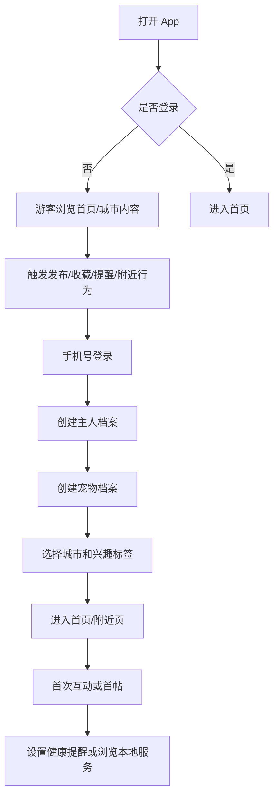
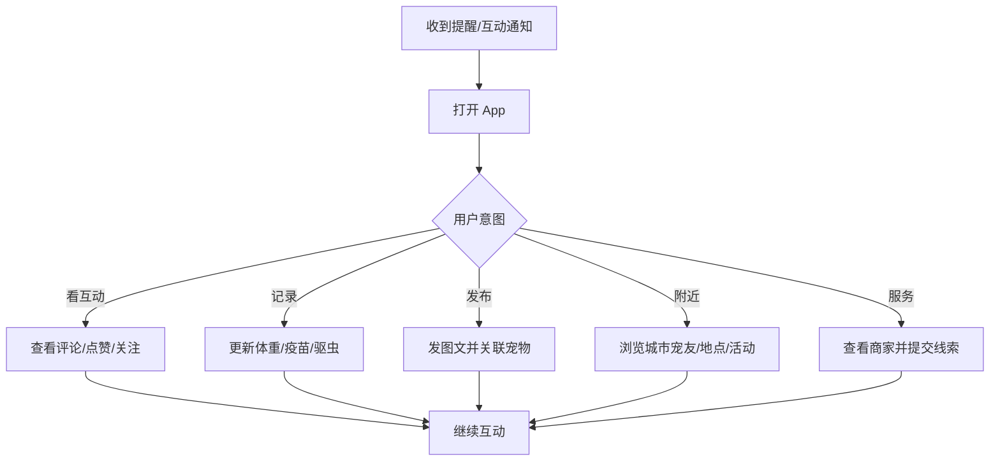

# PawPaw 宠物社交 MVP 方案

## 1. MVP 核心定位

PawPaw 首版不做“泛内容平台的宠物版”，而做一个以宠物为一级身份的工具型社区。

MVP 的核心命题是：用户是否愿意把宠物档案、日常内容、本地关系和基础养宠记录放进同一个产品里，并因此持续回来使用。

### 一句话定位

面向年轻养宠人的宠物身份社区：记录宠物生活，连接附近宠友，管理基础养宠事项，发现可信本地服务。

### 首版战略判断

| 判断 | MVP 取舍 |
| --- | --- |
| 宠物必须是一级实体 | 首次注册后引导创建宠物档案，内容、健康记录、附近匹配都围绕宠物展开 |
| 先做工具型社区 | 内容流只是入口，留存依赖提醒、记录、附近和服务线索 |
| 不做重交易 | 首版只做服务目录和预约意向，不做自营商城、担保支付、履约赔付 |
| 不正面复制大平台 | 不追求复杂推荐、直播、长视频、达人商业化 |
| 合规与安全前置 | 位置默认模糊展示，健康和走失等高风险数据单独处理 |

## 2. MVP 目标

### 目标周期

0-3 个月完成可上线 MVP，选择 1-2 个试点城市做小规模验证。

### 要验证的关键假设

1. 用户愿意完成“主人 + 宠物”双档案。
2. 宠物档案能提高内容发布、附近浏览、健康记录等行为的转化。
3. 附近宠友、城市内容和本地服务目录能形成独立 App 的差异化价值。
4. 健康提醒、成长记录等轻工具能拉动 D7/D30 留存。
5. 服务线索可以在不做交易闭环的情况下验证商业潜力。

### 北极星指标

有效宠物档案月活主人数。

有效宠物档案定义：已绑定主人、资料达到最低完整度，并在近 30 天发生过内容、互动、提醒、记录、附近或服务行为的宠物档案。

### Go / No-Go 指标

| 指标 | 目标 |
| --- | --- |
| 注册到宠物档案完成率 | >= 60% |
| 首日宠物绑定率 | >= 70% |
| 首帖率 | >= 20% |
| D7 留存 | >= 25% |
| D30 留存 | >= 15%-18% |
| 附近模块周活渗透 | >= 25% |
| 健康/提醒月记录率 | >= 20% |
| 服务线索提交转化率 | >= 8%-12% |
| 审核 SLA | 普通 UGC < 30 分钟 |

## 3. 目标用户

### 首发核心人群

| 用户 | 核心场景 | MVP 要解决的问题 |
| --- | --- | --- |
| 新手养猫/养狗人 | 建档、提问、疫苗/驱虫提醒、晒宠 | 信息分散，不知道怎么科学记录和求助 |
| 都市养狗双职工 | 附近遛狗、宠友约玩、找寄养/洗护/训练 | 本地需求强，但陌生人连接和服务信任弱 |
| 高频晒宠用户 | 发布图文、记录成长、获得互动 | 泛平台宠物关系弱，内容沉淀不到宠物本身 |
| 家庭共养用户 | 多人照顾同一只宠物、同步提醒和记录 | 信息散落在聊天记录和备忘录里 |
| 本地服务供给方 | 展示服务、获取咨询线索、管理评价 | 获客成本高，缺少垂直曝光和客户沉淀 |

### 首发城市建议

优先选择养宠密度高、本地服务供给成熟、年轻用户集中的城市，例如上海、杭州、深圳、成都、北京中的 1-2 个城区或城市先试点。

首版不做全国铺开，避免附近页空、商家供给薄、运营成本失控。

## 4. MVP 功能范围

### P0 必做

| 模块 | 功能 | 说明 |
| --- | --- | --- |
| 账号与登录 | 手机号登录、游客浏览、注销入口 | 手机号不公开展示；支持后续补充资料 |
| 主人档案 | 昵称、头像、城市、兴趣标签 | 不强制实名 |
| 宠物档案 | 名字、物种、品种、性别、生日/年龄、头像、城市、可见性 | 宠物是一级实体，不是用户资料字段 |
| 首页内容流 | 推荐/最新/关注/城市流 | 首版以规则流和时间流为主 |
| 内容发布 | 图文发布、最多 9 图、可关联宠物、话题标签 | 短视频可作为灰度，不作为首发硬依赖 |
| 互动 | 点赞、评论、收藏、关注用户/宠物 | 暂不做复杂私信 |
| 消息通知 | 评论、点赞、关注、系统通知 | 站内通知 + Push |
| 附近页 | 城市/行政区内容流、附近宠物列表、宠物友好地点列表 | 默认模糊位置，不展示精确坐标 |
| 问答 | 提问、回答、收藏、标签分类 | 禁止诊疗承诺，医疗相关强提示线下就医 |
| 健康记录 | 体重、疫苗、驱虫、绝育、生日、喂养提醒 | 用模板降低输入成本 |
| 服务目录 | 洗护、寄养、医院、训练、摄影等商家列表 | 只做展示和线索，不做支付闭环 |
| 服务线索 | 用户提交咨询/预约意向，商家后台查看 | 记录响应时间和状态 |
| 举报审核 | 内容举报、用户举报、商家举报、运营审核后台 | 社区上线基础设施 |
| Web 公开页 | 帖子详情页、宠物分享卡、走失卡占位页 | 用于分享和搜索入口 |
| Web 运营后台 | 内容审核、用户管理、商家管理、线索查看 | 首版简单可用即可 |

### P1 可做但不阻塞首发

| 模块 | 功能 |
| --- | --- |
| 短视频 | 30 秒以内短视频、限制分辨率、云审核 |
| 活动/约玩 | 官方活动、活动意向报名、候补、活动提醒 |
| 家庭共养 | 邀请家庭成员查看宠物档案和提醒 |
| 走失寻回 | 一键生成走失公开页和分享海报 |
| 会员灰度 | 高级提醒、更多相册容量、成长时间轴 |
| SEO 页面 | 城市页、百科页、问答详情页 |

### 明确不做

| 暂不做 | 原因 |
| --- | --- |
| 自营商城和库存电商 | 仓配、售后、资金占用重，首版验证成本过高 |
| 全国服务交易闭环 | 资质、客服、赔付和风控复杂 |
| 直播 | 内容审核和供给成本高 |
| 长视频 | 媒体成本、审核成本和创作门槛高 |
| 复杂 IM | 骚扰、风控和实时基础设施成本高 |
| 诊疗建议型 AI | 医疗风险高，不适合作为首发能力 |
| 精确地图社交 | 位置安全风险高，首版以城市/片区为粒度 |

## 5. 首版用户流程

### 新用户激活流程

### 内容与工具复访流程

## 6. 信息架构

### 移动端 App

底部 5 个一级入口：

| 入口 | 内容 |
| --- | --- |
| 首页 | 推荐流、关注流、最新流、城市流 |
| 附近 | 城市宠友、宠物友好地点、服务入口、活动占位 |
| 发布 | 图文发布、提问、记录 |
| 消息 | 互动通知、系统通知、服务线索通知 |
| 我的 | 主人资料、宠物档案、健康提醒、收藏、设置 |

### Web 公开端

| 页面 | 目的 |
| --- | --- |
| 帖子详情页 | 分享传播、搜索收录、引导下载/打开 App |
| 宠物卡分享页 | 展示宠物资料和精选动态 |
| 问答详情页 | 承接长尾搜索需求 |
| 走失卡公开页 | 公益传播和高价值分享 |
| 城市页 | 展示城市内容、地点、服务 |

### Web 商家/运营端

| 后台 | 功能 |
| --- | --- |
| 商家后台 | 商家资料、服务项目、线索列表、响应状态 |
| 运营后台 | 内容审核、举报处理、用户管理、商家审核、基础数据看板 |

## 7. 数据模型简版

MVP 需要优先保证以下核心实体清晰：

| 实体 | 关键字段 |
| --- | --- |
| User | id、phone_hash、nickname、avatar_url、city_code、risk_state、created_at |
| Pet | id、name、species、breed、sex、birth_date、avatar_url、city_code、visibility |
| OwnerPet | user_id、pet_id、role、is_primary |
| Post | id、author_user_id、post_type、body、city_code、privacy_level、created_at |
| PostPet | post_id、pet_id |
| MediaAsset | id、post_id、media_type、object_key、moderation_status |
| Comment | id、post_id、author_user_id、body、status |
| Reaction | id、post_id、user_id、reaction_type |
| FollowEdge | follower_user_id、followee_type、followee_id |
| HealthRecord | id、pet_id、record_type、value_json、occurred_at |
| Reminder | id、pet_id、reminder_type、next_trigger_at、repeat_rule |
| ServiceProvider | id、name、category、city_code、verify_status |
| ServiceListing | id、provider_id、category、city_code、status |
| Lead | id、listing_id、user_id、pet_id、status、created_at |
| Report | id、target_type、target_id、reporter_user_id、reason、status |

## 8. 技术方案

### 推荐技术栈

| 层 | MVP 方案 |
| --- | --- |
| 移动端 | Flutter |
| Web | React + Next.js |
| 服务端 | Go 模块化单体 |
| API | REST + BFF |
| 数据库 | PostgreSQL |
| 缓存 | Redis |
| 消息队列 | NATS JetStream 或 RabbitMQ |
| 搜索 | PostgreSQL FTS，增长后再切 OpenSearch/Elasticsearch |
| 媒体 | 对象存储 + CDN + 图片样式处理 |
| 审核 | 云内容审核 + 人工复核后台 |
| 部署 | 云主机/容器化部署，两可用区基础高可用 |

### 架构原则

1. 首版采用模块化单体，不提前拆复杂微服务。
2. 用户、宠物、内容、附近、健康、服务、审核模块在代码层保持清晰边界。
3. 发布内容、审核、通知、搜索索引用异步事件解耦。
4. 视频能力从严限制，先保证图文体验稳定。
5. 所有公开内容必须有审核状态。

## 9. 合规与安全基线

### 数据最小化

| 数据 | MVP 策略 |
| --- | --- |
| 手机号 | 仅用于登录和必要通知，脱敏展示 |
| 主人资料 | 只收昵称、头像、城市，不强制实名 |
| 宠物资料 | 用户主动填写，可控制可见性 |
| 精确位置 | 只在使用附近/服务时申请；前端默认展示城市/片区 |
| 健康记录 | 用户主动填写，默认不用于广告 |
| 图片视频 | 上传后去 EXIF，审核通过后公开 |
| 走失信息 | 默认不公开手机号全文和精确住址 |

### 必备能力

1. 隐私政策、用户协议、儿童/未成年人规则。
2. 权限按使用场景即时申请，不默认索权。
3. 用户可以注销、删除内容、撤回授权。
4. 个性化推荐提供关闭或切换到最新/关注流的入口。
5. 举报、申诉、封禁、限流流程可运营。
6. 医疗相关问答必须提示不替代兽医诊断。
7. App 备案、域名备案、日志留存和内容审核证据按国内要求准备。

## 10. 商业化验证

MVP 阶段不以收入最大化为目标，但要埋好商业化验证路径。

### 首版商业化顺序

| 阶段 | 模式 | 说明 |
| --- | --- | --- |
| MVP 内测 | 服务线索 | 免费或低价接入试点商家，验证线索质量 |
| 3-9 个月 | C 端会员 | 高级提醒、成长时间轴、家庭共养、更多相册容量 |
| 3-9 个月 | 本地服务线索费 | 按有效线索 8-30 元，或后续按成交佣金 |
| 9-18 个月 | 商家 SaaS | 299-999 元/月/店，提供线索管理和评价管理 |
| 9-18 个月 | 联营电商 | 内容导购，不做库存 |

### MVP 可埋点的收入信号

1. 用户点击服务商家的比例。
2. 用户提交预约/咨询意向的比例。
3. 商家响应时长和有效沟通率。
4. 用户对高级提醒、相册、成长时间轴的使用频次。
5. 用户是否愿意为家庭共养和高级工具付费。

## 11. 3 个月实施计划

### 第 1 阶段：产品骨架与核心数据，2-3 周

| 工作 | 产出 |
| --- | --- |
| 产品原型 | App 主流程、Web 公开页、运营后台原型 |
| 数据模型 | User、Pet、Post、Health、Service、Report 等核心表 |
| 技术基建 | 项目脚手架、登录、权限、对象存储、基础部署 |
| 合规文档 | 用户协议、隐私政策、权限清单初稿 |

### 第 2 阶段：社区与宠物档案，3-4 周

| 工作 | 产出 |
| --- | --- |
| 双档案 | 主人档案、宠物档案、宠物主页 |
| 内容发布 | 图文发布、图片上传、关联宠物、话题标签 |
| 内容流 | 最新流、关注流、城市流、基础推荐流 |
| 互动 | 点赞、评论、收藏、关注、通知 |
| 审核 | 云审核接入、人工审核后台、举报入口 |

### 第 3 阶段：附近、工具与服务，3-4 周

| 工作 | 产出 |
| --- | --- |
| 附近页 | 城市/行政区内容、附近宠物、地点列表 |
| 健康工具 | 疫苗、驱虫、体重、生日、喂养提醒 |
| 问答 | 提问、回答、收藏、分类、风险提示 |
| 服务目录 | 商家资料、服务列表、筛选 |
| 线索 | 用户提交咨询意向、商家/运营后台查看 |

### 第 4 阶段：试点上线与数据验证，2 周

| 工作 | 产出 |
| --- | --- |
| 埋点 | 激活、发布、互动、提醒、附近、线索漏斗 |
| 灰度 | TestFlight/安卓内测/小规模邀请 |
| 运营 | 首批内容、首批商家、城市页基础数据 |
| 复盘 | D1/D7、档案完成、首帖、线索、审核 SLA |

## 12. 团队与成本

### MVP 团队配置

| 角色 | 人数 |
| --- | --- |
| 产品经理 | 1 |
| UI/UX 设计 | 1 |
| 后端工程师 | 2-3 |
| Flutter 工程师 | 2 |
| Web 工程师 | 1 |
| 测试 | 1 |
| 运维/数据 | 0.5-1 |
| 运营/BD | 1-2 |

建议总规模：8-10 人核心研发产品团队，加 1-2 人城市运营/商家 BD。

### 粗略成本

| 成本项 | 估算 |
| --- | --- |
| 3 个月研发与设计人力 | 主要成本，视团队薪酬而定 |
| MVP 月云成本 | 1.5 万-4 万元 |
| 内容审核/短信/推送 | 按量计费，首期可控 |
| 试点城市运营 | 商家录入、种子内容、活动物料 |
| 买量 | 不建议首发重买量，优先邀请制、社群、线下合作、SEO |

## 13. 增长策略

### 冷启动优先级

1. 试点城市种子内容：宠物日常、地点、问答、服务商家。
2. 线下合作：宠物店、医院、洗护、寄养、宠物摄影放置二维码。
3. 分享增长：宠物卡、帖子详情、走失卡、问答详情页。
4. 工具召回：疫苗/驱虫/生日/体重记录提醒。
5. 城市运营：官方活动、宠物友好地点合集。

### 不建议首发依赖

1. 大规模信息流买量。
2. 高额创作者补贴。
3. 全国城市同时铺开。
4. 复杂达人商业化。

## 14. 核心埋点

| 漏斗 | 埋点 |
| --- | --- |
| 激活 | 打开 App、注册、创建主人档案、创建宠物档案、完成兴趣选择 |
| 内容 | 浏览 feed、点击帖子、发布、上传图片、关联宠物、点赞、评论、收藏、关注 |
| 附近 | 进入附近、切换城市/区域、点击宠物、点击地点、点击服务 |
| 工具 | 新建提醒、完成提醒、记录体重/疫苗/驱虫、查看成长记录 |
| 问答 | 提问、回答、收藏、查看风险提示 |
| 服务 | 查看商家、提交线索、商家响应、线索关闭 |
| 安全 | 举报、审核通过/拒绝、封禁、申诉 |
| 留存 | D1、D7、D30、周活、月活、有效宠物档案月活 |

## 15. 主要风险与应对

| 风险 | 表现 | MVP 应对 |
| --- | --- | --- |
| 内容流同质化 | 用户觉得像小红书低配版 | 强化宠物档案、附近、提醒、服务线索 |
| 附近页为空 | 城市内用户和商家密度不足 | 只做 1-2 个试点城市，运营预置地点和商家 |
| 档案链路太长 | 注册流失 | 支持游客浏览，关键行为触发后再补档案 |
| 位置安全 | 用户担心隐私或线下骚扰 | 默认模糊位置，前端不展示精确坐标 |
| 医疗问答风险 | 用户把回答当诊疗建议 | 禁止诊断结论，强提示就医，敏感内容审核 |
| 审核成本失控 | UGC 增长后违规处理跟不上 | 首版限制视频，云审核 + 人工复核 |
| 商家服务纠纷 | 虚假资质、响应慢、投诉 | 首版只做线索，商家审核，记录响应和投诉 |
| 过早商业化 | 伤害社区冷启动 | MVP 先验证付费信号，不强推付费墙 |

## 16. MVP 验收清单

上线前必须满足：

1. 用户能完成注册、创建主人档案、创建宠物档案。
2. 用户能浏览首页、城市流和附近页。
3. 用户能发布图文内容并关联宠物。
4. 用户能点赞、评论、收藏、关注并收到通知。
5. 用户能创建基础健康记录和提醒。
6. 用户能提问、回答、收藏问答。
7. 用户能浏览服务目录并提交咨询意向。
8. 运营能审核内容、处理举报、管理用户和商家。
9. Web 能打开帖子详情页、宠物分享页和基础公开页。
10. 隐私政策、用户协议、注销、删除、举报、权限说明可用。
11. 所有公开 UGC 都有审核状态。
12. 核心埋点可在后台查看。

## 17. MVP 成功后的下一步

如果 MVP 达到 Go 指标，3-9 个月进入 PMF 验证阶段：

1. 扩充服务目录和商家后台。
2. 上线活动/约玩和官方城市活动。
3. 灰度 C 端会员。
4. 增加家庭共养和成长时间轴。
5. 做 SEO 城市页、问答页、百科页。
6. 优化推荐，从规则流升级到标签召回 + 热度排序。
7. 选择第二批城市复制供给和运营模型。

如果未达到指标，优先判断问题来自哪里：

1. 档案完成率低：简化建档链路，允许更晚补充资料。
2. 首帖率低：优化发布器、模板、宠物成长记录转动态。
3. D7 低：强化提醒、通知和附近任务。
4. 附近弱：缩小试点区域，提高城市供给密度。
5. 服务线索弱：调整服务品类，优先高频刚需如洗护、寄养、医院。

