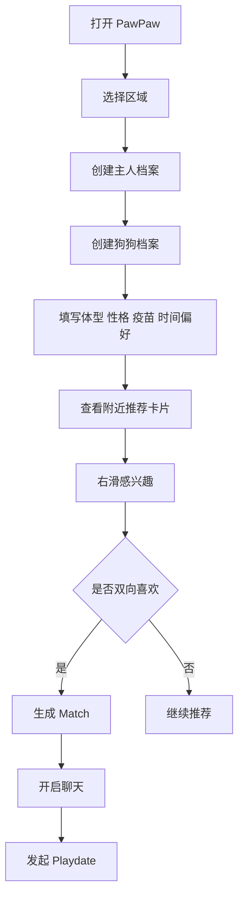
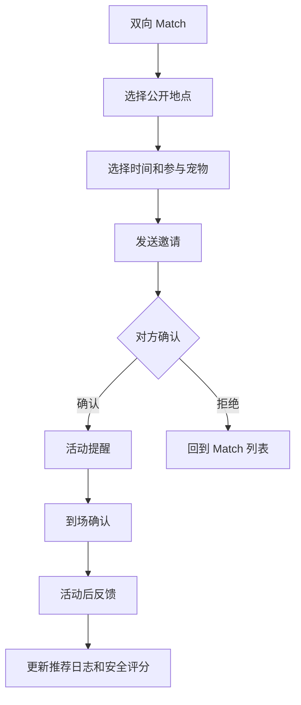

# PawPaw 本地狗狗 Playdate MVP 方案

## 1. 新定位

PawPaw 不再优先做泛宠物社交，也不做“宠物版小红书”。新的 MVP 聚焦为：

> 面向本地宠物主人的狗狗 playdate 匹配与宠物生活社区，基于位置、犬种、体型、性格、疫苗状态和时间偏好，帮助主人发现附近合适的宠物伙伴并组织安全见面。

英文定位：

> A local pet lifestyle and dog playdate matching platform that helps dog owners discover nearby compatible pets, organize safe meetups, and connect with trusted local pet services.

## 2. 为什么调整

原方案里的“宠物档案 + 附近关系 + 轻工具”是正确方向，但内容流仍然容易变成低配泛社区。新的 playdate 匹配方向更有三个优势：

| 维度 | 判断 |
| --- | --- |
| 产品落地 | 比纯动态流更具体，有遛狗、约玩、线下活动的真实场景 |
| 技术深度 | 能自然引入推荐、地理召回、缓存、低延迟、最终一致性、风控 |
| MVP 闭环 | 从档案到匹配、聊天、发起活动、反馈，形成完整行为链 |
| 冷启动 | 仍然困难，但可以通过小区域和线下 meetup 缩小问题 |

核心策略：**先做本地狗狗 playdate 匹配闭环，轻社区和服务目录后置。**

## 3. MVP 核心假设

1. 狗主人愿意为狗狗创建完整 profile，包括体型、性格、疫苗和可用时间。
2. 用户愿意浏览附近兼容狗狗，并通过 swipe 表达兴趣。
3. 双向喜欢后，用户愿意发起或接受 playdate。
4. 公开地点、模糊位置、举报/拉黑、疫苗状态能降低线下见面顾虑。
5. swipe、match、chat、playdate、feedback 数据可以形成后续推荐优化闭环。

## 4. 北极星指标

**成功完成的 playdate 数量。**

MVP 阶段可以拆成漏斗指标：

| 指标 | 目标 |
| --- | --- |
| 宠物档案完成率 | >= 70% |
| 可匹配档案占比 | >= 60% |
| 推荐卡片右滑率 | >= 15% |
| 双向 match rate | >= 5%-10% |
| match 后聊天启动率 | >= 35% |
| match 后 playdate 发起率 | >= 15% |
| playdate 完成率 | >= 50% |
| 举报/拉黑率 | 保持低位，作为质量约束 |
| D7 留存 | >= 25% |
| D30 留存 | >= 15%-18% |

不要只优化右滑率。右滑率高但聊天、playdate、反馈差，说明推荐质量不够。

## 5. 首发用户与区域

不要一开始做全美或全国城市。MVP 建议从一个小区域开始：

| 区域类型 | 示例 |
| --- | --- |
| 校园/社区 | UChicago / Hyde Park |
| 狗公园周边 | 2-3 个高频 dog park |
| 公寓社区 | 年轻养狗人集中的 apartment community |
| 城市片区 | 芝加哥某几个 neighborhood |

冷启动方式：

1. 先建 Instagram / Discord / 微信群。
2. 手动收集 50-100 个狗狗 profile。
3. 每周组织一次线下 dog meetup。
4. 用 Demo 或表单先做半自动匹配。
5. 验证用户是否会复用，再扩大产品能力。

## 6. MVP 功能范围

### P0 必做

| 模块 | 功能 | 说明 |
| --- | --- | --- |
| 账号与登录 | 手机号/邮箱登录、游客预览、注销 | MVP Demo 可先用模拟登录 |
| 主人档案 | 昵称、头像、区域、可用时间、线下偏好、隐私设置 | 主人安全偏好会影响匹配 |
| 宠物档案 | 犬种、年龄、体型、性别、绝育、疫苗、性格标签、活动偏好、可接受距离 | 宠物是核心一级实体 |
| 附近推荐 | 基于区域、体型、性格、疫苗、时间窗口召回候选狗狗 | 首版用规则 + 加权排序 |
| Swipe 匹配 | 左滑跳过、右滑感兴趣、已滑状态 | swipe 低延迟返回 |
| Match 生成 | 双向喜欢后生成 match | 用唯一约束和幂等防重复 |
| 简单聊天 | match 后开放文字聊天或留言 | MVP 可先做轻量 conversation |
| Playdate 发起 | 时间、公开地点、参与宠物、备注、疫苗要求、公开/私密 | 形成线下闭环 |
| Playdate 反馈 | 到场确认、评分、是否愿意再见、异常反馈 | 用于推荐质量和风控 |
| 地点目录 | 狗公园、宠物友好地点、vet/grooming 基础信息 | 服务目录从支持 playdate 开始 |
| 安全风控 | 举报、拉黑、模糊位置、公开地点提醒、疫苗标记 | 线下产品必须前置 |
| 后台 | 用户/宠物/举报/playdate/地点管理、数据看板 | 首版简单可运营 |
| 埋点 | 曝光、swipe、match、chat、playdate、feedback | 为后续推荐模型准备样本 |

### P1 后置

| 模块 | 功能 |
| --- | --- |
| 轻社区 Feed | 活动评价、附近动态、狗公园打卡 |
| 健康提醒 | 疫苗、驱虫、体重、绝育等提醒 |
| 服务线索 | 洗护、寄养、训练、医院线索 |
| Lost pet alert | 走失提醒公开页 |
| 推荐模型升级 | logistic regression / XGBoost / learning-to-rank |
| 实时聊天增强 | WebSocket、已读、在线状态、离线推送 |
| 会员 | 高级筛选、更多曝光、活动优先报名 |

### 明确不做

| 暂不做 | 原因 |
| --- | --- |
| 大型内容社区 | 容易偏离 playdate 主线，冷启动成本高 |
| 自营电商/交易闭环 | 履约、售后、资金占用重 |
| 复杂 IM/群聊 | MVP 只需要 match 后轻量聊天 |
| 精确实时定位 | 线下安全风险高 |
| AI 诊疗 | 医疗风险高 |
| 全国扩城 | 附近匹配必须先保证密度 |
| 深度学习推荐 | 数据不足，先用规则和加权排序 |

## 7. 核心用户流程

### 新用户激活



### Playdate 闭环



## 8. 信息架构

### 移动端 App

| 一级入口 | 内容 |
| --- | --- |
| 推荐 | Swipe 卡片、筛选、推荐解释 |
| Match | 双向匹配、聊天、发起 playdate |
| Playdates | 待确认、已确认、历史、反馈 |
| 地点 | 狗公园、宠物友好地点、基础服务 |
| 我的 | 主人档案、宠物档案、安全设置、黑名单 |

### Web / Demo

| 页面 | 目的 |
| --- | --- |
| Landing / Demo | 展示主链路和产品定位 |
| 宠物公开卡 | 分享宠物 profile |
| 地点页 | dog park / pet-friendly place 信息 |
| 后台 | 用户、宠物、match、playdate、举报、地点管理 |

## 9. 数据模型简版

| 实体 | 关键字段 |
| --- | --- |
| User | id、email/phone_hash、nickname、avatar_url、neighborhood、privacy_level、risk_state |
| OwnerProfile | user_id、available_windows、meetup_preferences、max_distance_km、safety_preferences |
| Pet | id、owner_user_id、name、species、breed、birth_date、sex、avatar_url |
| PetProfile | pet_id、size、neutered、vaccine_status、personality_tags、activity_preferences、accepts_large_dogs、energy_level |
| Location | id、name、type、city、neighborhood、geohash、is_public_place、safety_notes |
| RecommendationCandidate | user_id、candidate_pet_id、score、reason_codes、model_version、expires_at |
| Swipe | id、user_id、pet_id、target_user_id、target_pet_id、action、idempotency_key、created_at |
| Match | id、user_low_id、user_high_id、pet_low_id、pet_high_id、status、created_at |
| Conversation | id、match_id、status、last_message_at |
| Message | id、conversation_id、sender_user_id、body、seq、created_at |
| Playdate | id、creator_user_id、location_id、start_at、visibility、vaccine_required、status |
| PlaydateParticipant | playdate_id、user_id、pet_id、status、checked_in_at |
| Feedback | id、playdate_id、from_user_id、to_user_id、rating、repeat_intent、safety_flag |
| Report | id、reporter_user_id、target_type、target_id、reason、status |
| Block | blocker_user_id、blocked_user_id、reason、created_at |
| RecommendationLog | user_id、candidate_pet_id、rank_position、features_snapshot、shown_at、action、matched、chat_started、playdate_created、feedback_score |

关键约束：

```text
swipes unique(user_id, target_pet_id)
matches unique(user_low_id, user_high_id, pet_low_id, pet_high_id)
blocks unique(blocker_user_id, blocked_user_id)
```

Match 里的 user/pet id 需要归一化，避免 A-B 和 B-A 重复创建。

## 10. 技术方案

| 层 | MVP 方案 |
| --- | --- |
| 移动端 | Flutter，后续完整 App |
| Web Demo | 现阶段用 Vite/静态 Demo 快速展示主链路 |
| Web 正式 | React + Next.js，公开页和后台 |
| 服务端 | Go 模块化单体 |
| API | REST/BFF |
| 数据库 | PostgreSQL，后续加 PostGIS |
| 缓存 | Redis |
| 异步 | NATS JetStream / RabbitMQ |
| 搜索/地理召回 | MVP 用 geohash + PostgreSQL 索引，增长后用 PostGIS / Elasticsearch geo query |
| 消息 | MVP REST 轮询，后续 WebSocket |
| 部署 | Web 先 GitHub Pages，API 后续云主机/容器 |

## 11. 推荐系统路线

### 11.1 MVP 阶段不用复杂模型

PawPaw 的推荐对象不是普通商品，而是“狗狗 + 主人 + 线下见面场景”。早期数据量少，且安全约束强，所以 MVP 不优先使用深度学习或纯协同过滤。

当前 MVP 推荐策略是：

```text
候选召回 -> 硬规则过滤 -> 可解释加权排序 -> 行为日志记录
```

这样做的好处：

1. 冷启动时也能工作。
2. 推荐原因可解释，方便用户信任。
3. 运营可以手动调权重。
4. 安全规则始终可控。
5. 后续可以平滑接入开源推荐服务或离线模型。

### 11.2 候选召回

先从数据库里召回可能适合的候选狗狗，召回范围不要太大。

召回条件：

1. 同 neighborhood 优先。
2. 默认 5km 内，可按用户 `max_distance_km` 调整。
3. 狗狗 profile 完整度达标。
4. 主人和狗狗状态正常。
5. 可用时间有交集的候选优先。
6. 新用户或新狗狗保留少量探索曝光。

首发区域建议只做一个小片区，例如 Hyde Park / UChicago 周边。推荐系统早期最重要的是局部密度，不是算法复杂度。

### 11.3 硬规则过滤

以下规则必须在排序前执行，不能交给模型决定：

1. 排除当前用户自己的狗狗。
2. 排除已 swipe 的候选。
3. 排除已 block 的用户。
4. 排除高风险或被封禁用户。
5. 排除隐私设置不可见的 profile。
6. 排除不符合线下见面安全要求的候选。
7. 如果 playdate 要求疫苗，则限制未确认疫苗状态的候选。
8. 胆小、小型、不能接受大型犬的狗狗，不优先推荐高能量大型犬。

安全、隐私、合规规则永远是 hard filter。模型只能参与排序，不能覆盖安全底线。

### 11.4 加权排序

MVP 使用规则加权分数：

```text
score = 0.25 * location_score
      + 0.20 * personality_score
      + 0.15 * size_compatibility
      + 0.15 * schedule_overlap
      + 0.10 * activity_preference
      + 0.10 * vaccine_trust_score
      + 0.05 * freshness_score
```

字段含义：

| 特征 | 说明 |
| --- | --- |
| `location_score` | 距离越近、同 neighborhood 分越高 |
| `personality_score` | 性格标签重合、互补和风险冲突 |
| `size_compatibility` | 体型兼容，尤其保护小型犬和胆小犬 |
| `schedule_overlap` | 主人可用时间窗口重合度 |
| `activity_preference` | walk、dog park、cafe、training 等偏好重合 |
| `vaccine_trust_score` | verified 高于 self_reported，高于 unknown |
| `freshness_score` | 新 profile 和长时间未曝光 profile 适度加分 |

返回给前端时必须带 `reason_codes`，例如：

```json
[
  "same_neighborhood",
  "schedule_overlap_weekend_morning",
  "verified_vaccine",
  "small_dog_compatible",
  "shared_activity_dog_park"
]
```

前端展示文案可以是：

```text
Nearby in Hyde Park
Both available weekend morning
Verified vaccine status
Good size compatibility
Both enjoy dog parks
```

### 11.5 行为日志和权重

推荐质量的核心不是一开始选复杂模型，而是把行为数据记完整。

`recommendation_logs` 需要记录：

1. 谁看到了谁。
2. 候选排序位置。
3. 当时的 score 和 feature snapshot。
4. 用户是否 pass / like。
5. 是否生成 match。
6. match 后是否聊天。
7. 是否创建 playdate。
8. playdate 是否完成。
9. 反馈评分和 repeat intent。
10. 是否发生 report / block。

建议把行为转成训练样本时使用以下初始权重：

| 行为 | 权重 |
| --- | ---: |
| impression | 0 |
| pass | -1 |
| like | +2 |
| mutual match | +5 |
| chat started | +8 |
| playdate created | +15 |
| playdate completed | +25 |
| positive feedback | +30 |
| report | -40 |
| block | -50 |

这些权重不是最终模型，只是帮助后续做离线评估、简单排序模型和推荐服务接入。

### 11.6 开源推荐方案取舍

市面上有成熟开源方案，但不建议在 MVP 第一阶段直接替代业务规则。

| 方案 | 适合场景 | PawPaw 使用建议 |
| --- | --- | --- |
| Gorse | 开源推荐服务，支持 REST API、协同过滤、相似推荐、在线反馈 | 中期可作为推荐服务接入 |
| LightFM | Hybrid 推荐，能结合用户特征、物品特征和行为 | 有行为数据后做离线实验 |
| implicit | ALS / BPR 等隐式反馈协同过滤 | 用户行为量足够后再试 |
| RecBole | 推荐算法研究和 benchmark | 适合实验，不优先生产接入 |
| TensorFlow Recommenders | 自定义双塔召回、排序模型 | 数据规模较大后再考虑 |
| Metarank | 个性化 reranking 服务 | 有稳定候选集后做重排 |
| Vespa | 搜索、向量召回、复杂 ranking serving | 早期偏重，不建议 MVP 使用 |

推荐接入顺序：

1. MVP：Go 内部实现规则召回、过滤、加权排序。
2. Alpha：积累 1,000-10,000 条有效行为后，用 LightFM 或 Gorse 离线对比。
3. Beta：如果 Gorse 效果稳定，把它作为候选或重排服务，但业务层仍保留安全过滤。
4. 增长期：再考虑 learning-to-rank、TensorFlow Recommenders 或 Metarank。

### 11.7 推荐系统分阶段目标

| 阶段 | 推荐方式 | 目标 |
| --- | --- | --- |
| Demo | 前端静态规则 | 展示产品闭环 |
| MVP | 数据库召回 + Go 规则排序 | 小区域真实可用 |
| Alpha | 规则排序 + 行为权重校准 | 提升 match 和 playdate 质量 |
| Beta | Gorse / LightFM 辅助排序 | 利用真实行为个性化 |
| 增长期 | 双阶段召回排序 | 提升规模化推荐效率 |

### 11.8 评估指标

不要只看右滑率。右滑率高但 playdate 少，说明推荐只是“看起来喜欢”，没有形成线下价值。

| 阶段 | 指标 |
| --- | --- |
| 推荐 | right-swipe rate、pass rate、candidate exhaustion rate |
| Match | mutual match rate、duplicate match prevention |
| 质量 | chat initiation rate、reply rate、playdate creation rate |
| 线下 | playdate confirmation rate、completion rate、repeat meetup rate |
| 安全 | report rate、block rate、bad feedback rate |
| 留存 | D1、D7、D30 |

## 12. 缓存与低延迟

| 缓存 | Key | TTL / 策略 |
| --- | --- | --- |
| 宠物 profile | `pet_profile:{petId}` | 5-30 分钟，profile 更新主动失效 |
| 用户 profile | `user_profile:{userId}` | 5-30 分钟，隐私设置更新主动失效 |
| 推荐候选 | `recommend_candidates:{userId}:{geoHash}:{version}` | 1-10 分钟 |
| 推荐结果 | `recommend_feed:{userId}:{date}:{modelVersion}` | 短 TTL，保证短时间 feed 稳定 |
| Swipe 状态 | `swiped:{userId}` / `liked_by:{targetPetId}` | Redis 加速，最终状态落库 |
| 未读消息 | `unread:{userId}` | 消息写入后更新 |

目标：

| 接口 | 目标 |
| --- | --- |
| 获取推荐 feed | p95 < 100ms |
| 提交 swipe | p95 < 50ms |
| 打开 match/chat | p95 < 100ms |

## 13. 最终一致性设计

典型场景：双向喜欢生成 match。

同步路径：

1. 用户 A 右滑 B。
2. 校验参数和权限。
3. 写入 `swipes`，使用 `idempotency_key` 防重复。
4. 快速返回 swipe 结果。

异步路径：

1. 发出 `SwipeCreatedEvent`。
2. Worker 查询 B 是否已右滑 A。
3. 如果双向喜欢，归一化 user/pet id。
4. 插入 `matches`，依赖唯一约束防重复。
5. 发出 `MatchCreatedEvent`。
6. 创建 conversation，发送通知。

允许 match 通知延迟几百毫秒到几秒，但最终保证状态一致。

## 14. 合规与安全基线

1. 默认不展示家庭地址和精确坐标。
2. 使用 neighborhood / geohash 粒度做推荐。
3. 双方 match 后也只允许选择公开地点发起 playdate。
4. 支持举报、拉黑、取消 match。
5. 疫苗状态只是用户标记，不能包装成医疗认证。
6. 未成年人默认限制线下匹配能力。
7. 聊天内容支持举报。
8. 异常高频 swipe、被举报、被拉黑用户进入风控队列。

## 15. 3 个月实施计划

### 第 1 阶段：档案和匹配地基，2-3 周

| 工作 | 产出 |
| --- | --- |
| 产品原型 | 推荐卡片、match、playdate、后台原型 |
| 数据模型 | User、Pet、PetProfile、Swipe、Match、Playdate、Report |
| 技术基建 | 登录、权限、PostgreSQL、Redis、基础部署 |
| 种子数据 | 50-100 个狗狗 profile 和 10-20 个公开地点 |

### 第 2 阶段：推荐和 Swipe，3-4 周

| 工作 | 产出 |
| --- | --- |
| 推荐召回 | 按区域、体型、性格、时间过滤候选 |
| 加权排序 | Go 内部规则 scorer、可解释 score 和 reason codes |
| Swipe | 左滑/右滑、已滑过滤、低延迟写入 |
| Match | 双向喜欢生成 match、通知、match 列表 |
| 埋点 | impression、swipe、match、feature snapshot 记录 |

### 第 3 阶段：Playdate 和安全，3-4 周

| 工作 | 产出 |
| --- | --- |
| 聊天 | match 后简单 conversation |
| Playdate | 创建、邀请、确认、取消、提醒 |
| 地点 | dog park / pet-friendly place 列表 |
| 反馈 | 到场确认、评分、repeat intent、安全反馈 |
| 风控 | 举报、拉黑、后台处理 |

### 第 4 阶段：灰度和复盘，2 周

| 工作 | 产出 |
| --- | --- |
| 灰度 | 小区域邀请制上线 |
| 运营 | 线下 dog meetup、手动补充 profile |
| 数据看板 | 推荐漏斗、match 漏斗、playdate 漏斗 |
| 复盘 | 冷启动密度、推荐质量、安全事件、留存 |

## 16. 核心埋点

| 漏斗 | 埋点 |
| --- | --- |
| 激活 | 打开、注册、创建主人档案、创建宠物档案、完成可匹配字段 |
| 推荐 | 推荐曝光、候选位置、score、reason codes、跳过、右滑 |
| Match | 双向喜欢、match 生成、match 查看 |
| 聊天 | 首条消息、回复、聊天活跃 |
| Playdate | 创建、邀请、确认、取消、提醒、到场、完成 |
| 反馈 | 评分、repeat intent、安全反馈 |
| 安全 | 举报、拉黑、取消 match、封禁 |
| 留存 | D1、D7、D30、周活、月活 |

## 17. MVP 验收清单

上线前必须满足：

1. 用户能创建主人档案和狗狗档案。
2. 狗狗档案包含体型、性格、疫苗、活动偏好、可用时间。
3. 用户能看到附近推荐卡片。
4. 用户能左滑/右滑，重复滑动被去重。
5. 双向喜欢能生成 match，且不会重复生成。
6. Match 后能打开简单聊天或留言。
7. 用户能发起 playdate，选择公开地点和时间。
8. 对方能确认、拒绝或取消 playdate。
9. 活动后能提交反馈。
10. 用户能举报、拉黑、取消 match。
11. 后台能查看用户、宠物、match、playdate、举报。
12. 核心推荐和 playdate 漏斗可统计。

## 18. 成功后的下一步

如果 MVP 达标：

1. 扩大到第二个 neighborhood。
2. 引入 WebSocket 聊天。
3. 增加活动页和官方 dog meetup。
4. 增加服务目录：grooming、vet、training。
5. 用推荐日志校准规则权重，并离线评估 Gorse / LightFM。
6. 增加会员：高级筛选、更多曝光、活动优先报名。
7. 做公开宠物卡和地点 SEO 页面。

如果未达标：

1. Match 少：缩小区域，提高 profile 密度。
2. 右滑低：优化推荐规则、profile 质量和卡片信息。
3. Match 后不聊天：增加破冰问题和 playdate 模板。
4. Playdate 少：用官方活动和公开地点降低决策成本。
5. 安全顾虑高：强化公开地点、疫苗标记、举报拉黑和活动规则。
